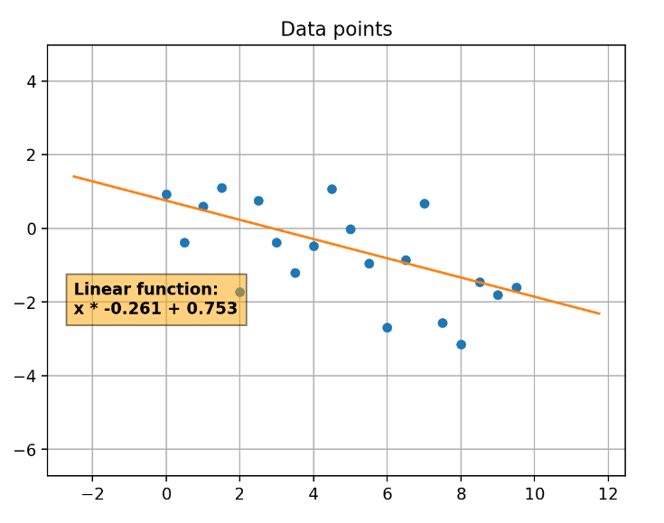

# Data generator for machine learning models

This repository is meant to be a collection of scripts for generating 
different data sets that can be used to train machine learning models.

This data points are randomly generated and try to imitate real world data.
They can be used to test how a model performs on different data 
distributions for the same task.

## Available generators

### [Linear regression](https://github.com/fiquinho/data-generator/tree/master/linear_regression)
https://fiquinho-data-generator-streamlit-app-2x60yn.streamlitapp.com/Linear_Regression
This module will create a data set of 2D data points that can be model 
using linear regression. They will be created by randomly deviating from 
a linear function. The linear function parameters, and the distribution 
of the deviations can be controlled by the script. It will generate a 
.csv file with the data, and it will plot the generated data. The linear 
function and the deviations distribution can also be plotted.

The plotted data will look something like this:

